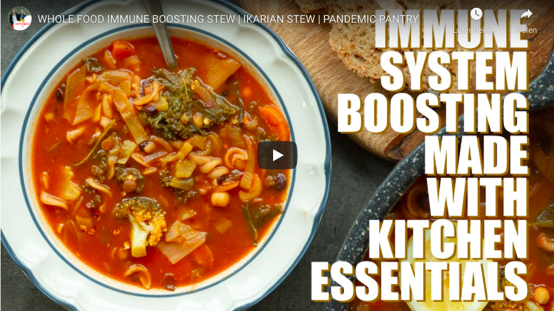

## Wholefood immune boosting Ikarian Stew - no oil - for weight loss -

This recipe is based on an Ikarian longevity stew that one of the longest living families in the world seemingly ate every day for lunch. They had a collective age of 861 years in one of The Blue Zones! This is so nourishing and tasty, it's oil-free, high in beans, and lentils and lots of cruciferous veg. A great dish to nurture your immune system.

**Serves: 8-10**

**Prep time: 40 mins**

**Cook time: 5-10 mins**

**Difficulty: Easy**

### Ingredients

_To be added_

### Directions

- Peel and finely dice the onion and garlic. Cut the leeks in half lengthwise and then into 2cm rounds, finely slice the carrots. Cut the broccoli into small florets and ensure to use all the stalk. Drain and rinse the cooked beans and lentils tins. Remove the kale from the stalk and finely chop the stalk.

* Heat a large pot on high heat. Once hot add the onion and garlic and cook for 3-4 minutes stirring regularly. If it starts to stick add 2 tbsp of veg stock and loosen. Once they start to brown slightly add the chopped leak, carrots, broccoli stalk, kale stalk and a generous pinch of salt and 50ml of veg stock and put the lid on and leave to sweat for 10 mins stirring occasionally.

* Next add the rest of the ingredients, (the tins beans and lentils, tomato passata, tomato puree, tamari, veg stock, pasta and kale). With the lid on bring to the boil and reduce to a low heat and simmer for 10 mins. Taste and adjust the seasoning to your pallet and add some chilli flakes if you like it spicier

* Serve with some fresh bread for a super-nourishing meal!
